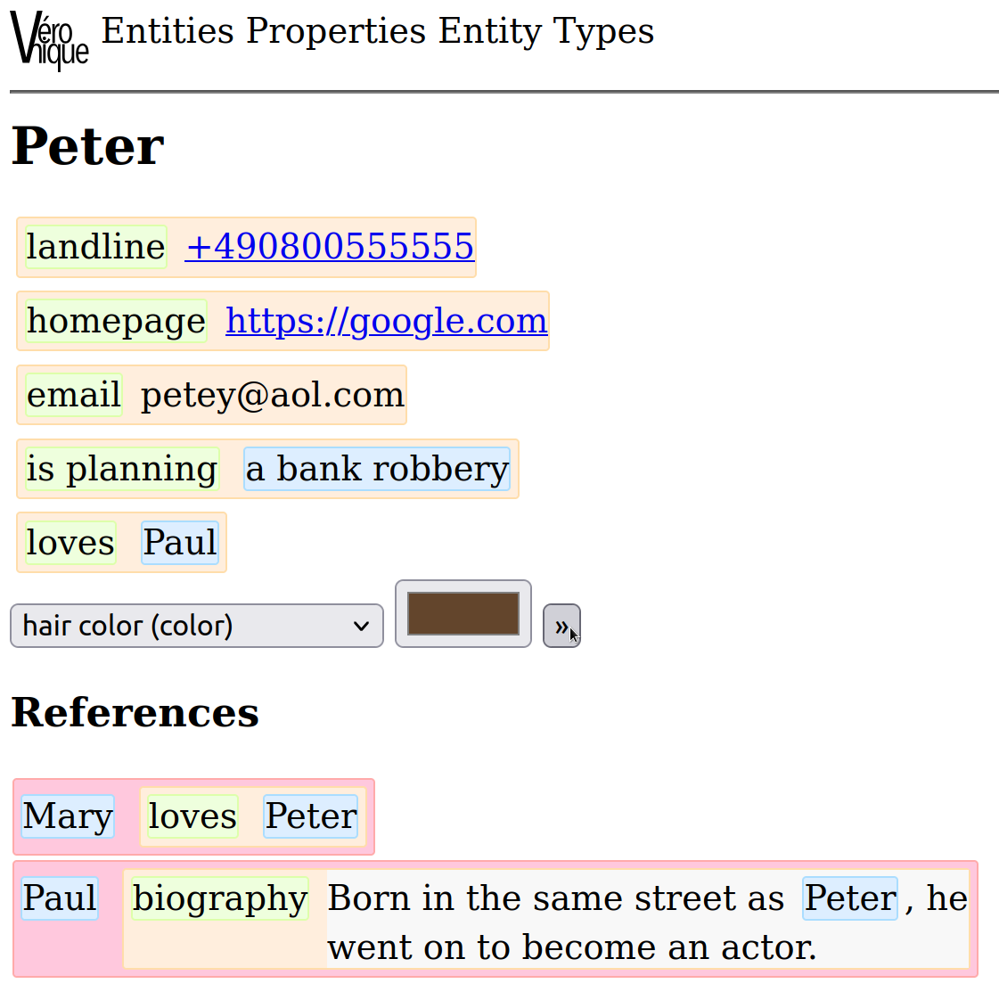

# Véronique

_A small database for storing entities, links between them and simple
properties (e.g. text, color, numbers)._

Intended as a private social network/people database to help with memorizing
facts about people, but there's not really any features specific to that.

This is meant as a personal, intentionally non-scalable tool. As such, it uses
SQLite, and there's no proper packaging yet (mostly because it's not needed).
The app is protected from unauthenticated access, but beyond that there's no
protection against e.g. XSS. This is a feature, you can put HTML into text
fields for example. If you need SSO, MFA, or any other similar features, use a
different tool.

## Development

- Clone the repo
- Install its dependencies to a venv, e.g. via `pip install -e .`
- _Either_: Place a file called `veronique_initial_pw` containing a password in
  the working directory. This will be the password of the `admin` user.
- _Or_: Run `veronique-bootstrap` to fill the database with testing
  data. The password of the admin user will be "admin". **This irrevocably
  overwrites any existing db you may have.**
- Run `sanic veronique:app --dev`

## Deployment

For a production environment you can directly install the `veronique` package,
which will get you the latest released version. If you want to be very
up-to-date, you can also do the above and just remove the `--dev` flag. Maybe
set up a systemd service for it and point a reverse proxy at it or something. I
personally [use
ansible](https://github.com/L3viathan/ansibly/blob/master/roles/mainserver/tasks/veronique.yml)
for deploying new versions.

Missing migrations are automatically applied when restarting the app.
