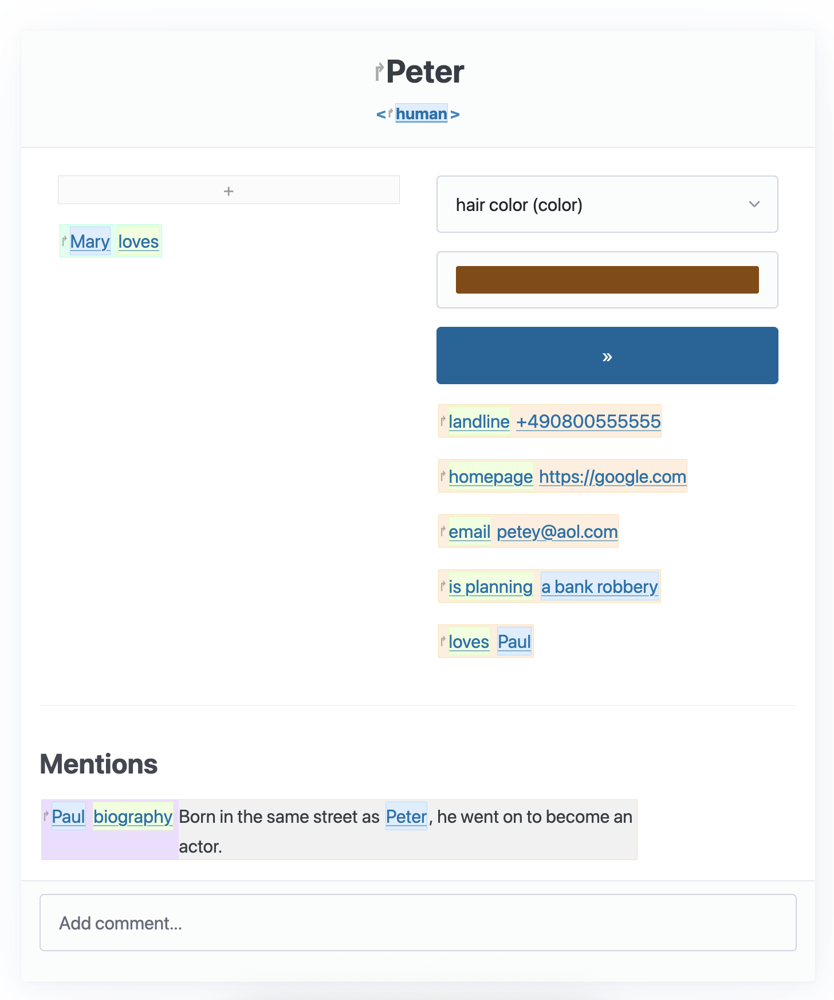

# Véronique

_A small database for storing entities, links between them and simple
properties (e.g. text, color, numbers)._

Intended as a private social network/people database to help with memorizing
facts about people, but there's not really any features specific to that.

This is meant as a personal, intentionally non-scalable tool. As such, it uses
SQLite, and there's no proper packaging yet (mostly because it's not needed).
The app is protected by basic auth, but beyond that there's no protection
against e.g. XSS. This is a feature, you can put HTML into text fields for
example. If you need SSO, MFA, or any other similar features, use a different
tool.

## Development

- Clone the repo
- Install `sanic` (to a venv)
- Place a file called `veronique_initial_pw` containing a password in the
  working directory. This will be the password of the `admin` user.
- Run `sanic api --dev`

## Deployment

Running in production mostly means removing the `--dev` flag. Maybe set up a
systemd service for it and point a reverse proxy at it or something. I
personally [use
ansible](https://github.com/L3viathan/ansibly/blob/master/roles/mainserver/tasks/veronique.yml)
for deploying new versions.

Missing migrations are automatically applied when restarting the app.

## Concepts

The datatype starts mostly empty, only a few internal verbs are added during
the initial migration. There's also a fixed list of _data types_, since they
need supporting Python code.

### Claim

A claim can be thought of as a simple sentence: It (normally) has a subject, a
verb, and an object. For example, "John loves Mary", "Peter is 28 years old",
or "Paul knows that [John loves Mary]".

A subject is either another claim, or NULL. The latter is only possible when
the verb is a special builtin one called `ROOT`. Root claims have no subject
and no object and merely exist as markers for _something_; any kind of entity.

When you create a root claim, you also automatically create a second internal
claim of type `LABEL`, such that the thing you're creating has a name.

Now that we bootstrapped the world with root claims, we can talk about other
types of claims: They (non-root claims) always have a subject claim (which can
be, but doesn't have to be a root claim), a verb, and an object. The object can
either be another claim (when the verb has the data type `directed_link` or
`undirected_link`) or some atomic value (e.g. a number, a string, a date, ...).

### Verb

A verb has a similar function as it does in human language. You might also call
it a property or a predicate. A verb always has a label (what it's called, e.g.
`"loves"`), and a data type (see below). There's also a few built-in verbs that
get special treatment:

- `ROOT` and `LABEL` (as described above)
- `IS_A`: They have the data type `directed_link` and describe an is-a
  relation. You could for example create a root fact called `"human"` and link
  all people you create to it. There's special UI treatment for this relation
  (it's displayed in the heading of the claim detail view). A claim can have
  several `IS_A` links.
- `VALID_FROM` and `VALID_UNTIL`: They have the data type `date` and describe
  that a fact is only valid before or after a certain date. Invalid facts are
  visible as such in the frontend.
- `AVATAR`: A special field of type `picture` that will be used as the avatar
  for facts in their detail view and almost all other references to it.

### Data type

A data type describes what kind of object a claim of a certain verb can take.
Notable data types are:

- `directed_link`: This represents a regular link or transitive verb, e.g.
  `"loves"`, `"is child of"`, etc.
- `undirected_link`: These represent relationships that are by their nature
  undirected. You could use this for `"friend of"`, `"partner of"`, `"works
  with"`, or similar verbs, if you assume/model that this is never one-sided.
- `string`, `number`, `text`, `boolean`: As you might expect, these are fairly
  straightforward. Booleans get a checkbox as an input, string and text differ
  by the size of their input controls (regular input vs. textarea).
- `date`: Dates get special treatment in Véronique: You should enter them as
  `%Y-%m-%d` ISO timestamps, _but_ you are allowed to replace any digit with a
  question mark. This allows you to represent dates such as "some time in
  1973" or "26th of July, but I don't know which year", which can be common
  when entering data without full knowledge of the truth.

### Users

Véronique now has basic support for additional users. Non-admin users only have
read access, and only to a selected list of verbs. That list always includes
all internal verbs, and can optionally include others. The user can then only
see claims of that verb type, e.g. only birth dates.

## Future plans

- [ ] allowing users to _write_ claims of some verb types (i.e., adding a
  `write-verb` permission). As opposed to how it's handled for reading,
  internal verbs should have to be explicitly allow-listed here. We would
  probably also have to add an "owner" field to each claim, unless we're fine
  with users being able to _add_ claims, but not being able to delete or edit
  them.
- [ ] Queries can never be made writable by regular users, as that involves
  arbitrary database access, but we could let them _see_ allowed queries.
- [ ] a new (internal) verb called "comment", with special UI support. This
  could be used to carefully allow editing of a Veronique instance by regular
  users (by allowing them to exclusively create comments, which can then be
  resolved by an admin).
