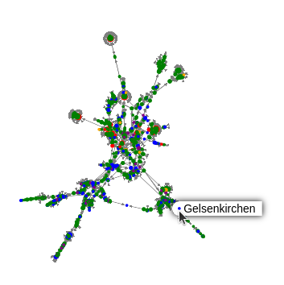

# Advanced Topics

## Bulk claims

Sometimes you find yourself wanting to create many claims of the same kind for
a whole bunch of entities. For this purpose, Véronique lets you create bulk
claims.

Start by selecting <kbd>New</kbd> &rarr; <kbd>Bulk claim</kbd>, then start
typing the first entity name. Clicking on it adds it to the selection. Repeat
this process until you have selected all desired entities.

Next, click on <kbd>Make bulk claim</kbd>.

You'll be redirected to something that looks a bit like an entity/claim detail
page. Add a claim in the usual way, and it will be added once per selected
entity.

## Queries

You can use SQL to answer questions about your data, such as:

- What are the oldest dates in my database?
- Which of my ancestors lived the longest?
- Who among my contacts shares birthdays (and which birthday is the most
  common)?

To create a query, click on <kbd>New...</kbd>&rarr;<kbd>Query</kbd>. After
entering a label, you can type SQL into the black box below. To try out your
query without saving it, click on <kbd>Preview</kbd>. Once you're happy with it
you can press the submit button to save your query (you can now find it in the
<kbd>Go to...</kbd> menu).

### (Simplified) schema

The most relevant tables in the database are `claims` and `verbs`. Claims have
an `id`, a `subject_id`, a `verb_id`, and either an `object_id` or a `value`
(depending on whether its a relation or not). (Note that undirected links exist
in one arbitrary direction, not in both, even if it's shown like that in the
UI.)

Verbs have an `id` and a `label`.

(This is not the full schema, for that you'll need to read [the
code](https://github.com/L3viathan/veronique/) yourself.)

### Special column names

There's a few naming conventions that influence how queries are displayed:

- If you end a column name with `_v` or `_c`, the columns will be interpreted
  as verb or claim IDs, respectively, and displayed accordingly.
- If you are selecting an _array_ of verb or claim ids, use `_vs`/`_cs`.
- Ending a column name in `_<name of a data type>` (e.g. `_location`) will
  display the column like a verb of that type would be.

When a column contains one claim per row (ending in `_c`), a little "[N]" link
is displayed after the column name, which will link to a [network
view](#network) of that set of claims.


### Example queries

Because this is all pretty abstract, here's a few sample queries you could do:

```sql
-- shared birthdays, sorted by amount of people that have that birthday
SELECT
    substr(c.value, 6) AS date,
    COUNT(*) as count,
    group_concat(c.subject_id) AS people_cs
FROM claims c
LEFT JOIN verbs v
    ON c.verb_id = v.id
WHERE
    c.value IS NOT NULL
    AND substr(c.value, 6) <> '??-??'
    AND v.label LIKE '%birth%'
GROUP BY substr(c.value, 6), v.id
HAVING count(*) > 1
ORDER BY count(*) DESC
```

```sql
-- oldest people at the time of their death
SELECT
    p.id as person_c,
    (julianday(d.value) - julianday(b.value))/365.25 AS age
FROM claims p
LEFT JOIN claims b
    ON b.subject_id = p.id
LEFT JOIN claims d
    ON d.subject_id = p.id
WHERE
    b.verb_id = 2  -- "birth date" verb
    AND d.verb_id = 5  -- "death date" verb
    AND julianday(d.value) - julianday(b.value) IS NOT NULL
ORDER BY julianday(d.value) - julianday(b.value) DESC
```

```sql
-- people with the highest number of children
SELECT
    p.object_id AS person_c,
    COUNT(p.object_id) AS "number of children"
FROM claims p
WHERE p.verb_id = 1  -- "child of" verb
GROUP BY p.object_id
ORDER BY COUNT(p.object_id) DESC
```

As you may be able to tell, you will often need to join claims with themselves.

## Network

To get a visual overview, click on <kbd>Go to...</kbd>&rarr;<kbd>Network</kbd>.



You can zoom, drag the canvas, and click on claims to go to their page. You can
also restrict the categories or verbs that you want to visualize. The
visualization has its limits, but can be interesting, for example to find
disconnected claims or to discover previously unknown connections.

The visualization, powered by [Sigma.js](https://sigmajs.org) and
[Graphology](https://graphology.github.io) will attempt to cluster related
nodes as far as possible, and will continue doing so forever, or until you
press the stop button.
