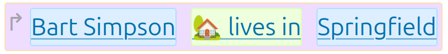
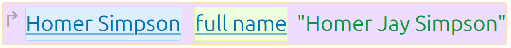

# Claims & Entities

## Entities

An entity is something. A named thing. It could be a human, a place, an event; anything you can give a name to.

An entity by itself has only a name (and an automatically assigned ID).

## Claims

A claim can be thought of as a simple sentence:

It has a subject (the entity "Bart Simpson"), a verb ("lives in"), and an object (the entity "Springfield").
Sometimes the object is not an entity, but plain data, [which can take many different forms](data-types.md):

