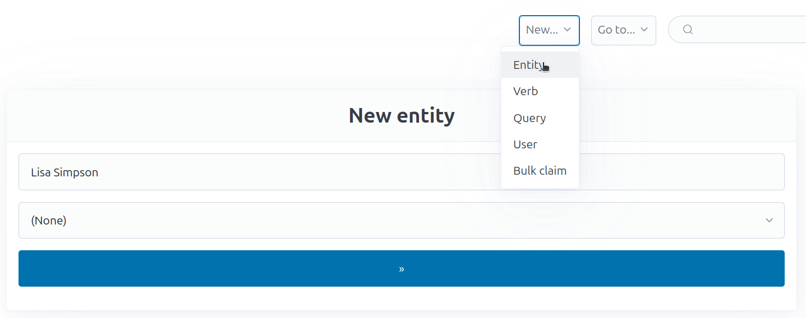
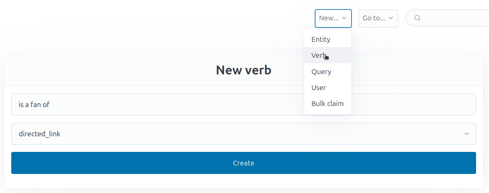
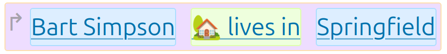
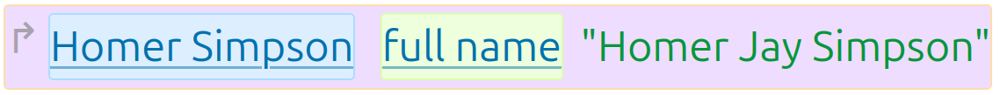
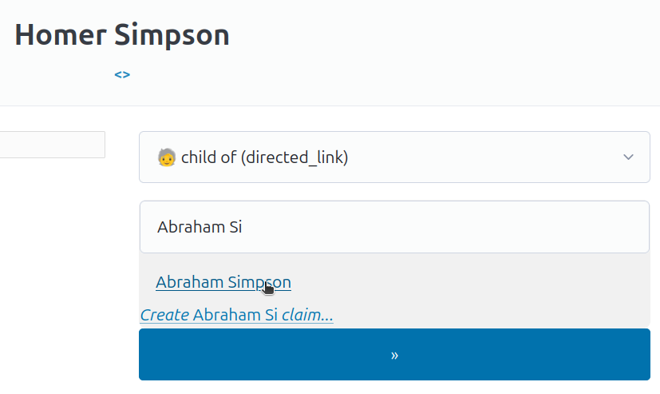
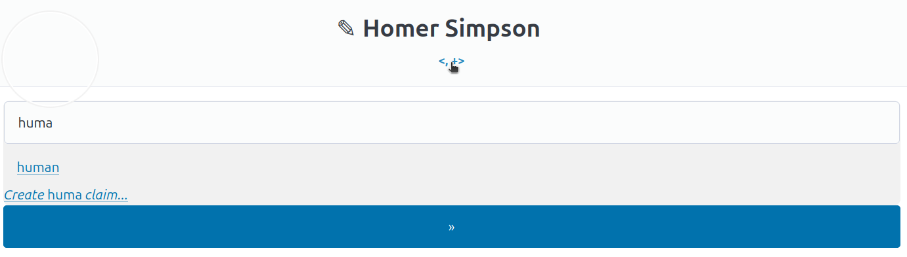
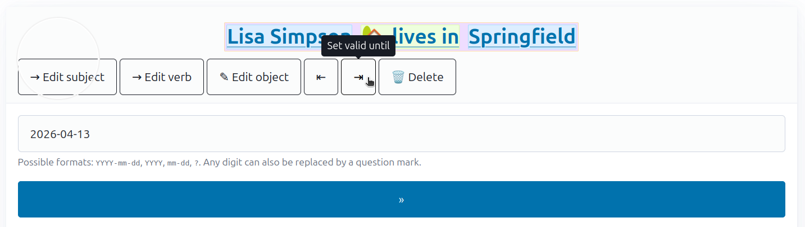

# Concepts

## Entities

An entity is something. A named thing. It could be a human, a place, an event;
anything you can give a name to.

An entity by itself has only a name (and an automatically assigned ID).

### Creating entities

To create a new entity, select <kbd>New</kbd> &rarr; <kbd>Entity</kbd>. Then
enter a name (and optionally select a [category](#categories), more on that
later) and click the big submit button:

You'll end up on the page of this entity, which will look pretty empty for now.

### Renaming entities

When hovering over the title of an entity on its page, you will see a pen icon
<kbd>✎</kbd>. Clicking on it shows an input field with which you can rename an
entity.

## Verbs

Verbs connect let you connect entities (and claims) with other entities (and
claims), _or_ with data. A verb also has a name, like "loves" or "lives in" or
"was born on", and a [type](data-types.md).

To create a new verb, select <kbd>New</kbd> &rarr; <kbd>Verb</kbd>. Next, enter
a name, and select the type. For now, let's select `directed_link`, which links
two entities (or other claims):

## Claims

Finally, we can combine entities and verbs into _claims_.

A claim can be thought of as a simple sentence:

It has a subject (the entity "Bart Simpson"), a verb ("lives in"), and an
object (the entity "Springfield"). Sometimes the object is not an entity, but
plain data, [which can take many different forms](data-types.md):

To create a claim, click on the <kbd>+</kbd> button on one of the sides of an
entity page, then start typing the name of the other entity until you see it
and click on it:

Which side you choose determines whether this entity will be the subject or the
object of the claim. Only outgoing claims (made by clicking on the <kbd>+</kbd>
on the right) can be made with plain data, incoming claims can only be made to
other entities/claims.

### Categories

You may want to add different _kinds_ of things into your Véronique database.
To facilitate this, there's a built-in verb called `category` that gets special
UI support.

A category is nothing special, it's just another entity.

To mark something as a category, click on the little plus under the heading of
an entity page that represents one of its members and start typing the name of
the category.

Once something is a category of another entity, you will be able to select it
as the category of an entity when creating a new entity (it will appear in the
dropdown input). Choose your first category wisely, as it will be the category
that will be selected by default when creating a new claim. The author of this
document uses "human" as the default category.

### Entities are claims

It's high time to reveal a little secret: Entities are also claims. They are
just special claims that lack a subject and have the special verb `root`.
(Their object is their name.) You can actually not just link entities together,
but claims of any kind, to form nested sentences like "Peter thinks that Mary
loves Paul".

### Special verbs

While you can (and should) create your own verbs, veronique comes with a few
built-in ones. `root` was already mentioned above, as was `category`. The
remaining built-in verbs are:

#### **`valid_from`/`valid_until`**

Every non-entity claim can have validity information. These mean that this
information isn't valid all the time. For example, if you have a verb called
"lives in" and someone moves towns, you could add a new "lives in" claim for
them and annotate the old one with `valid_until` and the new one with
`valid_from`, both with the date of moving as the object.

Non-entity claims have a little "handle" to their left: <kbd>↱</kbd>. By
clicking on it, you'll go to the page of that claim, on which you can use the
<kbd>⇤</kbd> and <kbd>⇥</kbd> buttons to add validity info. This is a
`date`-type verb, so enter a (partial) date in [a sensible
format](https://en.wikipedia.org/wiki/ISO_8601) like `2026-06-05` or
`1992-??-??` (for details see the documentation for the
[date](data-types.md#date) verb).

When a claim is "definitely invalid", it will be shown with partial
transparency.

#### **`avatar`**

Entities can have avatars. By clicking on the circle left of the header, you'll
be able to upload an image. This image will then be shown on the entity page,
and whereever the entity is shown (e.g. as part of a claim).

#### **`comment`**

