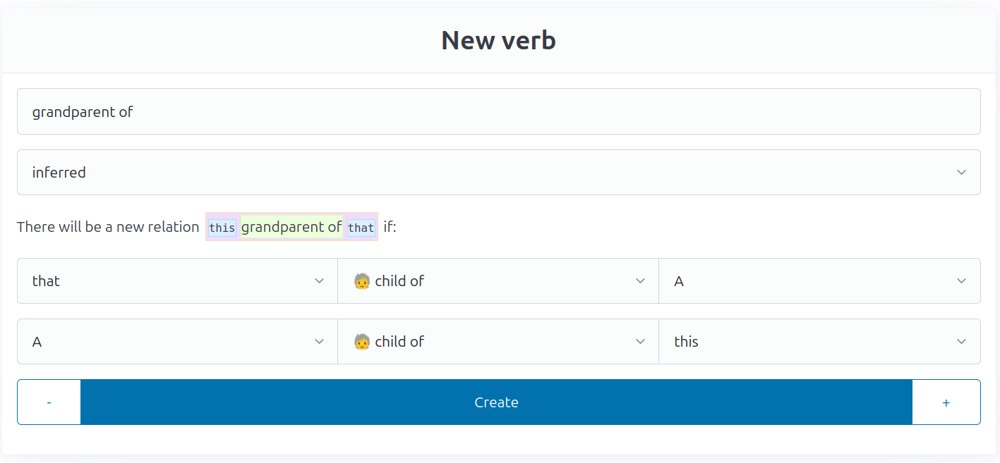
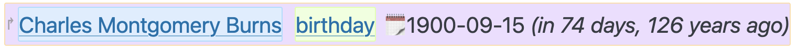

# Data types

Verbs can have many different types:

## `directed_link`

This represents a directed relation between two claims/entities. This will be
most kinds of relations, but it requires a directionality, i.e., "child of",
"lives in", etc.

## `undirected_link`

Where relations are between equal members ("partner of", "friend of", "works
with"), you want to use the `undirected_link` type instead. These will look
identical from either side.

## `inferred`

Inferrable verbs are special in that you never explicitly create any claims for
them. Instead, they get shown automatically when a set of conditions is
fulfilled. The prime example of this would be a "sibling" or "grandparent"
relation — you can define it by a combination of other relations.

Peter is a grandparent of Mary if there's another person whos the parent of
Mary and the child of Peter:

After entering a name and selecting `inferred` as the type, you'll need to
define what it means by "this" (your subject) being in that relation with
"that" (your object). To define the relation, you'll need additional helper
claims (a "parent" in both of the examples above). Every row needs to hold for
the relation to exist. Click the <kbd>+</kbd> button to create a new row, and
fill in each input to the desired value. "A", "B", and so on are these helper
claims.

## `string`

A simple, short text. Use this for things that would usually fit in one line.

## `text`

Behaves mostly like `string`, but you'll have a multiline input, and the output
renders as Markdown.

## `number`

Another one in the group of very simple types. This represents a number that
will usually not change. For ages theres a [dedicated type](#age).

## `color`

To be honest, I don't know if this is ever useful, but it was just easy to
create. Maybe for "hair color" or "favourite color" or "corporate design
primary color" or something like that.

## `date`

Véronique has special support for dates. There's three ways in which you can
enter them:

- If you know the day and month, but not the year, you can provide the date in
  the format `mm-dd` (e.g. "02-13").
- If you only know the year, but not day or month, simply enter the four-digit
  year.
- If you know the exact date, use the full ISO 8601 format of `YYYY-mm-dd`
  (e.g. "2025-02-13").
- Finally, you can use any of the above formats and replace one or more digits
  with a question mark to indicate lack of knowledge. For example, `06-??`
  represents "some time in June some year". You may even just provide a single
  "?" (for "completely unknown date"), but that is rarely useful.

When displaying a date, Véronique compares it with the current date and shows a
human-readable diff:

## `boolean`

A simple boolean (true/false) input. Shown as a checkbox.

## `location`

A place on earth, in the format a map application would understand (including
with latitude/longitude coordinates). When editing a location with coordinates,
shows a little map on which you can click to set new coordinates. Display links
to OpenStreetMap.

## `email`

A simple email type, clicking on it opens your mail program.

## `website`

A link to a website.

## `phonenumber`

A telephone number. You can either enter an international phone number (with a
leading `+`), or a national one. In that case it will transform it into a phone
number from the default phone region as [configured in the
settings](administration.md).

## `picture`

This lets you upload any kind of image. Technically it will let you upload any
file, but when viewed, it will be presented as an image (with an `` tag),
so anything other than images will appear broken.

## `social`

A "social" verb refers to someone's presence on a social media platform. When
creating such a verb, you can specify a template containing a pair of curly
braces, for example `https://social.example.com/@{}`. When making a claim of
this type, you just fill in the part that replaces the braces, and the
resulting link will be clickable.

Perhaps this type should be called "templated string" instead.

## `mtgcolors`

For a bit of fun, this type allows you to annotate something with a mana cost.
Basic colours only, it's intended to be used for
[personalities](https://homosabiens.substack.com/p/the-mtg-color-wheel).

## `alpha2`

An ISO-3166-1 alpha 2 code, also known as the two-letter country code. It's
displayed alongside a little flag.

## `age`

Often, you will only know someone's age, but not their birthday. By creating an
age-type verb, you can just enter someones age at some date (defaulting to
"today"), and Véronique will automatically figure out the possible range of
creation/birth dates this could refer to. When _editing_ an age claim, any
changes you make won't _replace_ but instead further restrict the range.

For example, if you enter someone's age as "50" on the 1st of January,
Véronique will say their birthday is on any day of the year, fifty years ago.
If you then edit the claim and just save it as "50" again on the 31st of March,
the range of possible birth dates will now be 1st of April until 31st of
December in that year.

If you want to enter an age that you know from some other date, you can prefix
the age with a fully specified date (e.g. `2025-04-13:47`). You may also enter
an age range (such as `47-52`).

## `choice`

A simple enum type. When creating a verb of this type, you can specify any
number of possible choices. Creating a claim then gives you a dropdown menu
from which you can select one option.

## `choices`

This behaves exactly like `choice`, except you can select multiple values in a
single claim.
